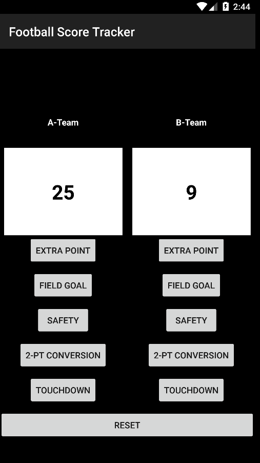

## Football Score Keeper

### Synopsis
This is the second project in Udacity's Android Basics Nanodegree. For this project, I created an that allows the user to track the score of a football game by dividing up the UI into two columns and giving each team their respective set of buttons to designate a scoring play.

### Concepts and Technologies Used
- Java
- XML
- Working with nested layouts
- Handling and validating user input
- Handling button clicks
  - Implementing onClickListener
- Android development best practices
    - sp for font size
    - dp for sizing
    - using xml files to reference strings instead of hardcoding

### Screenshot

